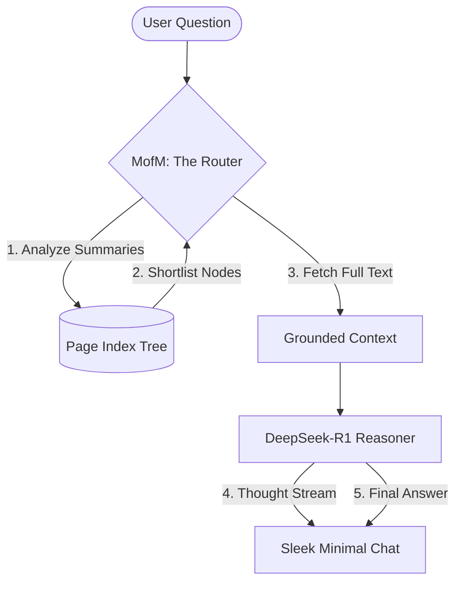

# ⚡ Vectorless RAG: The Marauder's Map for LLMs

> **A high-precision, zero-embedding RAG architecture designed for the Wizarding World (and your structured documents).**

Traditional RAG builds a "fog of war" by slicing your documents into arbitrary chunks and scattering them in a vector database. **Vectorless RAG** replaces the fog with a clear, hierarchical map—enabling LLMs to navigate through a **Page Index Tree** to find exactly which chapter, page, or paragraph contains the truth.

---

## 🧙 The Architecture

Unlike standard RAG, which relies on mathematical similarity (vectors), this system mimics how a human librarian works. It uses a **multi-stage routing process** to narrow down a massive library into the specific context needed for a reasoning model.



---

## 📜 The Hierarchical Page Index
The heart of the system is `hp1_pageindex_tree.json`. Instead of flattened chunks, we preserve the **natural hierarchy** of the document.

- **🏦 Corpus**: The entire library.
- **📄 Document**: Individual volumes (Philosopher's Stone).
- **🔖 Chapter**: Symbolic boundaries with human-written summaries.
- **📍 Page**: Granular anchors for perfect citation.

### 💎 Why Vectorless?
| Feature | 🕸️ Standard Vector RAG | 🪄 Vectorless Tree RAG |
| :--- | :--- | :--- |
| **Indexing Speed** | Slow, repeated embedding calls | **Instant** (Zero-latency map) |
| **Retrieval Logic** | Mathematical similarity (k-NN) | **Semantic Routing** (LLM Choice) |
| **Precision** | Risk of "fragmented" context | **Full-Chapter Context** |
| **Infrastructure** | Vector DB (Pinecone/Weaviate) | **Single JSON File** |
| **Cost** | $$$ (Storage + Embeddings) | **$0.00** (Pure Inference) |

---

## 🛡️ The Reasoning Edge
By using **DeepSeek-R1-0528**, we separate the **"Where is it?"** from the **"What does it mean?"**.

1. **📍 Routing**: A lightweight pass over chapter summaries identifies the relevant chapters.
2. **🧠 Context Injection**: We inject the **entire relevant chapter** into the model's memory.
3. **⚡ Deep Reasoning**: The model performs an internal "Thinking" process over the raw text, ensuring no narrative nuance is lost to arbitrary chunking.

---

## 💸 Economic Advantage: Tokens well spent
We stop wasting money on "guessing" location with vector math. Instead, we invest every cent into **Reasoning**. 

- **🚫 Zero Embedding Overhead**: $0.00 spent on OpenAI/Cohere embedding API calls.
- **⌛ Time Saved**: No more waiting for "Indexing" to complete. Add a PDF, update the Tree, and you're live.
- **🎯 Higher ROI**: Because the Reasoner (DeepSeek) sees the *entire chapter*, its answers are grounded in 100% of the relevant text, not a few scattered snippets.


---

## 🚀 Getting Started

### 1. The Alchemist's Setup (Backend)
```bash
cd backend
pip install -r requirements.txt
python app/main.py
```

### 2. The Mirror of Erised (Frontend)
```bash
cd frontend
npm install
npm run dev
```

---

> *"I solemnly swear that I am up to no good (and using highly efficient RAG architectures)."* 
> — **Vectorless RAG v1.0.0**

[View Repository](https://github.com/Satharva2004/Vectorless-RAG)
